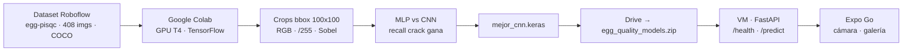

# 01 - Arquitectura

## Diagrama de flujo

## Capas

1. **Datos**: Roboflow entrega imágenes + anotaciones COCO (bounding boxes). El notebook recorta cada huevo con un margen del 4%, convierte BGR→RGB y estandariza a 100x100. Licencia CC BY 4.0.
2. **Entrenamiento**: Colab con GPU T4. Dos arquitecturas (MLP densa y CNN) entrenadas con los mismos callbacks para comparación justa. La decisión final la toma el **recall de `crack`**, no el accuracy.
3. **Servicio**: FastAPI carga `mejor_cnn.keras` y preprocesa la imagen recibida con el MISMO contrato (RGB, 100x100, /255). Expone `/health` y `/predict`.
4. **Cliente**: app Expo/React Native que captura o selecciona la foto y la envía por HTTP multipart.

## Decisiones y PORQUÉ

| Decisión | Por qué |
|---|---|
| Recorte por bbox antes de entrenar | Elimina fondo irrelevante, reduce costo, estandariza (mismo formato para MLP y CNN) |
| 100x100 | Balance entre resolución suficiente para ver grietas y costo de entrenamiento en T4 |
| Preprocesamiento idéntico en API | El modelo solo entiende su contrato: si la app manda otra cosa, la predicción es basura |
| Recall de crack como criterio | Un huevo roto que pasa por bueno llega al cliente: error caro e invisible |
| Sobel (cv2.filter2D) como demostración | Conecta el procesamiento clásico de imágenes con el deep learning (creatividad evaluable) |